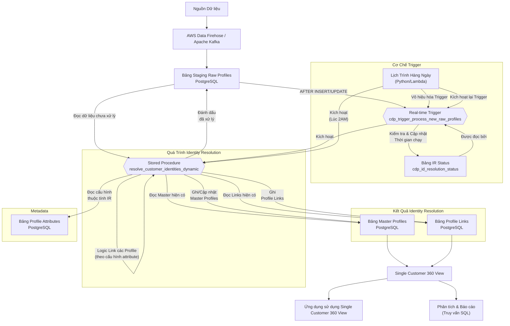

# Giải Pháp Nhận Dạng Danh Tính Khách Hàng

## Bắt đầu setup infrastructure

Tài liệu này mô tả giải pháp kỹ thuật để xây dựng hệ thống nhận dạng danh tính khách hàng (Customer Identity Resolution - CIR) nhằm hợp nhất dữ liệu khách hàng từ nhiều nguồn khác nhau thành một hồ sơ duy nhất. Giải pháp sử dụng AWS Kinesis Data Firehose cho ingestion dữ liệu và AWS RDS for PostgreSQL 16 làm trung tâm xử lý và lưu trữ.

Các bước thiết lập hạ tầng ban đầu bao gồm:

1.  **Thiết lập AWS RDS for PostgreSQL 16:**
    * Tạo một instance RDS PostgreSQL 16.
    * Chọn loại instance phù hợp với workload (ví dụ: `db.r6g.xlarge` hoặc lớn hơn cho 5 triệu profile và xử lý nặng), cấu hình Multi-AZ cho tính sẵn sàng cao.
    * Chọn loại lưu trữ SSD (khuyến nghị gp3) với dung lượng ban đầu đủ lớn (ví dụ: 100-200GB) và có thể mở rộng.
    * Cấu hình Security Groups để cho phép kết nối từ Firehose và các quy trình/ứng dụng cần truy cập database.
    * Tạo người dùng database với các quyền cần thiết.
2.  **Thiết lập AWS Kinesis Data Firehose:**
    * Tạo một Delivery Stream mới.
    * Cấu hình nguồn dữ liệu (ví dụ: Direct PUT, Kinesis Data Streams).
    * Chọn đích là "Amazon RDS".
    * Cấu hình kết nối đến instance RDS PostgreSQL đã tạo (endpoint, port, tên DB, user/password - nên sử dụng AWS Secrets Manager).
    * Chỉ định bảng đích ban đầu cho dữ liệu thô (`cdp_raw_profiles_stage`).
    * Cấu hình ánh xạ dữ liệu từ dữ liệu nguồn (ví dụ: JSON) sang các cột của bảng `cdp_raw_profiles_stage`.
    * Cấu hình xử lý lỗi và lưu trữ bản sao lưu vào S3.
    * Đảm bảo cấu hình mạng (VPC, Security Groups) cho phép Firehose kết nối đến RDS.
3.  **Thiết lập Môi trường Lịch Trình Hàng Ngày:**
    * Chuẩn bị môi trường để chạy script Python định kỳ (ví dụ: máy chủ EC2 với cron, AWS Lambda được kích hoạt bởi CloudWatch Events).
    * Cài đặt thư viện cần thiết (ví dụ: `psycopg2` cho Python).
    * Cấu hình quyền truy cập database cho môi trường này (sử dụng IAM roles hoặc Secrets Manager).

Độ chính xác của giải pháp phụ thuộc nhiều vào **chất lượng dữ liệu** đầu vào. Cần có các quy trình tiền xử lý và chuẩn hóa dữ liệu (ví dụ: làm sạch địa chỉ, chuẩn hóa số điện thoại) trước khi dữ liệu được đưa vào Firehose hoặc ngay sau khi vào bảng staging.

## Các Thành phần Chính

Giải pháp bao gồm các thành phần chính sau:

* **AWS Kinesis Data Firehose:** Dịch vụ ingestion dữ liệu stream, đẩy dữ liệu thô vào bảng staging trong RDS.
* **AWS RDS for PostgreSQL 16:** Cơ sở dữ liệu trung tâm, lưu trữ dữ liệu, metadata và thực thi logic xử lý.
    * **Bảng Staging (`cdp_raw_profiles_stage`):** Nơi dữ liệu thô từ Firehose được ghi vào.
    * **Bảng Metadata (`cdp_profile_attributes`):** Định nghĩa cấu trúc và thuộc tính của các trường dữ liệu profile, bao gồm cả cấu hình cho nhận dạng danh tính (thuộc tính nào dùng để ghép nối, quy tắc ghép nối, cách tổng hợp dữ liệu).
    * **Bảng Master Profiles (`cdp_master_profiles`):** Lưu trữ các hồ sơ khách hàng "vàng" đã được giải quyết.
    * **Bảng Profile Links (`cdp_profile_links`):** Lưu trữ mối quan hệ liên kết giữa các bản ghi thô và hồ sơ master.
    * **Stored Procedure (`resolve_customer_identities_dynamic`):** Chứa toàn bộ logic nhận dạng danh tính, đọc cấu hình từ `cdp_profile_attributes` và xử lý dữ liệu trong bảng staging.
    * **Extensions:** `citext`, `fuzzystrmatch`, `pg_trgm` hỗ trợ so sánh chuỗi và fuzzy matching.
* **Real-time Trigger (`cdp_trigger_process_new_raw_profiles`):** Một trigger trên bảng `cdp_raw_profiles_stage` để kích hoạt xử lý ngay khi có dữ liệu mới đến.
* **Trigger Function (`process_new_raw_profiles_trigger_func`):** Hàm được gọi bởi real-time trigger, có nhiệm vụ gọi stored procedure chính.
* **Lịch Trình Hàng Ngày (External Scheduler):** Một quy trình bên ngoài (ví dụ: script Python) được lên lịch chạy định kỳ để đảm bảo quét toàn bộ bảng staging và quản lý trạng thái của real-time trigger.

## Flow chính


Biểu đồ sau mô tả luồng dữ liệu và các thành phần trong giải pháp:




## Thiết lập Database Schema (SQL)

Phần này cung cấp các lệnh SQL để tạo cấu trúc cơ sở dữ liệu cần thiết.

### Extension 

```sql
-- Cài đặt các Extension cần thiết cho Fuzzy Matching
CREATE EXTENSION IF NOT EXISTS citext; -- Cho so sánh không phân biệt chữ hoa chữ thường
CREATE EXTENSION IF NOT EXISTS fuzzystrmatch; -- Cho soundex, dmetaphone, levenshtein
CREATE EXTENSION IF NOT EXISTS pg_trgm; -- Cho similarity based on trigrams
```

### Tables for meta-data

```sql
-- Bảng Metadata: attribute_type (Placeholder - cần định nghĩa chi tiết nếu sử dụng FK)
-- Bảng này định nghĩa các loại control UI hoặc kiểu attribute chung.

-- Bảng Metadata: attribute_type (Placeholder - cần định nghĩa chi tiết nếu sử dụng FK)
-- Bảng này định nghĩa các loại control UI hoặc kiểu attribute chung.
CREATE TABLE IF NOT EXISTS cdp_attribute_type (
    id SERIAL PRIMARY KEY,
    type_name VARCHAR(100) UNIQUE NOT NULL
);

-- Bảng Metadata: objects (Placeholder - cần định nghĩa chi tiết nếu sử dụng FK)
-- Bảng này định nghĩa các loại đối tượng chính (ví dụ: Customer, Product).
CREATE TABLE IF NOT EXISTS cdp_objects (
    id SERIAL PRIMARY KEY,
    object_name VARCHAR(100) UNIQUE NOT NULL
);

-- Bảng Metadata: cdp_profile_attributes
-- Bảng này định nghĩa *meta-data* cho từng thuộc tính (attribute) của profile.
-- Đã thêm các cột giả định cho cấu hình ghép nối và tổng hợp dữ liệu.
CREATE TABLE cdp_profile_attributes (
    id BIGSERIAL PRIMARY KEY,
    attribute_internal_code VARCHAR(100) UNIQUE NOT NULL,
    name VARCHAR(255) NOT NULL,
    status VARCHAR(50) DEFAULT 'ACTIVE', -- vd: 'ACTIVE', 'INACTIVE', 'DELETED'
    attribute_type_id INT NULL REFERENCES cdp_attribute_type(id), -- FK đến bảng attribute_type
    data_type VARCHAR(50) NOT NULL, -- vd: 'VARCHAR', 'INT', 'BOOLEAN', 'DATETIME', 'JSON', 'FLOAT'
    object_id INT NULL REFERENCES cdp_objects(id), -- FK đến bảng cdp_objects (vd: 1='Customer')
    is_required BOOLEAN DEFAULT FALSE,
    
    is_index BOOLEAN DEFAULT FALSE, -- Có nên tạo index cho giá trị của attribute này không?
    is_masking BOOLEAN DEFAULT FALSE, -- Có cần che (masking) giá trị của attribute này khi hiển thị không? (PII)
    storage_type VARCHAR(50) NULL, -- Cách lưu trữ giá trị (vd: 'COLUMN', 'JSON_FIELD')
    attribute_size INT NULL, -- Kích thước dữ liệu (vd: max length cho VARCHAR)
    attribute_group VARCHAR(100) NULL, -- Nhóm logic trên UI
    parent_id BIGINT NULL REFERENCES cdp_profile_attributes(id), -- ID của attribute cha (cho cấu trúc lồng)
    option_value JSON NULL, -- Lưu các tùy chọn nếu là dropdown, radio button, etc.
    process_status VARCHAR(50) NULL, -- Trạng thái liên quan đến quy trình xử lý dữ liệu
    attribute_status VARCHAR(50) NULL, -- Trạng thái cụ thể khác
    last_processed_on TIMESTAMP WITH TIME ZONE NULL, -- Thời gian xử lý dữ liệu liên quan đến attribute này lần cuối
    created_at TIMESTAMP WITH TIME ZONE DEFAULT CURRENT_TIMESTAMP,
    created_by VARCHAR(100) NULL,
    update_at TIMESTAMP WITH TIME ZONE NULL, -- Sẽ được cập nhật bởi trigger
    update_by VARCHAR(100) NULL,

    -- Cột bổ sung cho cấu hình Identity Resolution
    is_identity_resolution BOOLEAN DEFAULT FALSE, -- CÓ dùng thuộc tính này để tìm và hợp nhất profile không?
    is_synchronizable BOOLEAN DEFAULT TRUE,
    data_quality_score INT NULL, -- Điểm đánh giá chất lượng dữ liệu mặc định/tiềm năng
    matching_rule VARCHAR(50) NULL, -- vd: 'exact', 'fuzzy_trgm', 'fuzzy_dmetaphone', 'none'
    matching_threshold DECIMAL(5, 4) NULL, -- Ngưỡng cho fuzzy match (vd: 0.8)
    consolidation_rule VARCHAR(50) NULL -- Cách tổng hợp giá trị (vd: 'most_recent', 'non_null', 'concatenate', 'prefer_master', 'prefer_raw')
);
```

### Trigger

```sql 
-- Trigger để tự động cập nhật cột update_at
CREATE OR REPLACE FUNCTION update_profile_attributes_timestamp()
RETURNS TRIGGER AS $$
BEGIN
    NEW.update_at = NOW();
    -- update_by có thể được set bởi ứng dụng trước khi UPDATE,
    -- hoặc bạn có thể thử lấy user hiện tại nếu phù hợp với ngữ cảnh
    RETURN NEW;
END;
$$ LANGUAGE plpgsql;

CREATE TRIGGER before_profile_attributes_update
BEFORE UPDATE ON cdp_profile_attributes
FOR EACH ROW
EXECUTE FUNCTION update_profile_attributes_timestamp();
```
### Table cdp_raw_profiles_stage

```sql
-- Bảng 1: cdp_raw_profiles_stage
-- Firehose sẽ đẩy dữ liệu vào bảng này. Lược đồ cần khớp với dữ liệu đầu vào của bạn.
CREATE TABLE cdp_raw_profiles_stage (
    raw_profile_id UUID PRIMARY KEY DEFAULT gen_random_uuid(), -- ID duy nhất cho mỗi bản ghi thô
    -- Các cột dữ liệu thô tương ứng với các attribute được định nghĩa trong cdp_profile_attributes
    -- Tên cột ở đây nên khớp với attribute_internal_code nếu storage_type là 'COLUMN'
    first_name VARCHAR(255),
    last_name VARCHAR(255),
    email citext, -- Sử dụng citext cho email
    phone_number VARCHAR(50), -- Cần chuẩn hóa số điện thoại trước hoặc trong quá trình xử lý
    address_line1 VARCHAR(255),
    city VARCHAR(255),
    state VARCHAR(255),
    zip_code VARCHAR(10),
    -- Thêm các trường dữ liệu khác từ nguồn
    source_system VARCHAR(100), -- Hệ thống nguồn của bản ghi
    received_at TIMESTAMP WITH TIME ZONE DEFAULT NOW(),
    processed_at TIMESTAMP WITH TIME ZONE -- Đánh dấu thời gian xử lý
);

-- Tạo Index cho các trường quan trọng dùng cho ghép nối
-- Cần tạo index cho TẤT CẢ các thuộc tính có is_identity_resolution = TRUE và is_index = TRUE
-- Loại index (B-tree, GIN) phụ thuộc vào data_type và matching_rule
CREATE INDEX idx_raw_profiles_stage_email ON cdp_raw_profiles_stage (email); -- B-tree cho citext exact match
CREATE INDEX idx_raw_profiles_stage_phone ON cdp_raw_profiles_stage (phone_number); -- B-tree cho VARCHAR exact match
CREATE INDEX idx_raw_profiles_stage_name_trgm ON cdp_raw_profiles_stage USING gin (first_name gin_trgm_ops, last_name gin_trgm_ops); -- GIN cho fuzzy_trgm
-- Thêm các index khác dựa trên cấu hình cdp_profile_attributes
```

### Table cdp_master_profiles

```sql
-- Bảng 2: cdp_master_profiles
-- Lưu trữ các hồ sơ khách hàng đã được giải quyết (unique identities)
CREATE TABLE cdp_master_profiles (
    master_profile_id UUID PRIMARY KEY DEFAULT gen_random_uuid(), -- ID duy nhất cho hồ sơ master
    -- Các trường dữ liệu tổng hợp hoặc đáng tin cậy nhất từ các hồ sơ thô liên quan
    -- Tên cột ở đây nên khớp với attribute_internal_code nếu storage_type là 'COLUMN'
    first_name VARCHAR(255),
    last_name VARCHAR(255),
    email citext,
    phone_number VARCHAR(50),
    address_line1 VARCHAR(255),
    city VARCHAR(255),
    state VARCHAR(255),
    zip_code VARCHAR(10),
    -- Thêm các trường tổng hợp khác
    created_at TIMESTAMP WITH TIME ZONE DEFAULT NOW(),
    updated_at TIMESTAMP WITH TIME ZONE DEFAULT NOW(),
    -- Các trường metadata về quá trình giải quyết
    first_seen_raw_profile_id UUID, -- ID của bản ghi thô đầu tiên liên kết với master này
    source_systems TEXT[] -- Danh sách các hệ thống nguồn liên quan đến master này
);

-- Tạo Index cho các trường quan trọng dùng cho tìm kiếm master
-- Cần tạo index cho TẤT CẢ các thuộc tính có is_identity_resolution = TRUE và is_index = TRUE
-- Loại index (B-tree, GIN) phụ thuộc vào data_type và matching_rule
CREATE INDEX idx_master_profiles_email ON cdp_master_profiles (email); -- B-tree cho citext exact match
CREATE INDEX idx_master_profiles_phone ON cdp_master_profiles (phone_number); -- B-tree cho VARCHAR exact match
CREATE INDEX idx_master_profiles_name_trgm ON cdp_master_profiles USING gin (first_name gin_trgm_ops, last_name gin_trgm_ops); -- GIN cho fuzzy_trgm
-- Thêm các index khác dựa trên cấu hình cdp_profile_attributes
```

### Table cdp_profile_links

```sql
-- Bảng 3: cdp_profile_links
-- Liên kết các hồ sơ thô với hồ hồ sơ master tương ứng
CREATE TABLE cdp_profile_links (
    link_id BIGSERIAL PRIMARY KEY,
    raw_profile_id UUID NOT NULL REFERENCES cdp_raw_profiles_stage(raw_profile_id),
    master_profile_id UUID NOT NULL REFERENCES cdp_master_profiles(master_profile_id),
    linked_at TIMESTAMP WITH TIME ZONE DEFAULT NOW(),
    match_rule VARCHAR(100) -- Ghi lại quy tắc nào đã dẫn đến việc liên kết (ví dụ: 'ExactEmailMatch', 'FuzzyNamePhone', 'DynamicMatch')
);

-- Tạo Index để tra cứu nhanh các link
CREATE INDEX idx_profile_links_raw_id ON cdp_profile_links (raw_profile_id);
CREATE INDEX idx_profile_links_master_id ON cdp_profile_links (master_profile_id);

-- Ràng buộc duy nhất để tránh liên kết một raw_profile_id với nhiều master_profile_id
ALTER TABLE cdp_profile_links ADD CONSTRAINT uk_profile_links_raw_id UNIQUE (raw_profile_id);
```

## Cơ chế "Real-time" Trigger

Để xử lý dữ liệu mới đến từ Firehose theo thời gian thực, chúng ta tạo một trigger trên bảng `cdp_raw_profiles_stage`. Trigger này sẽ kích hoạt một hàm trigger đơn giản, hàm này có nhiệm vụ gọi stored procedure nhận dạng danh tính chính (`resolve_customer_identities_dynamic`) để xử lý các bản ghi mới.

**Để tránh quá tải database khi Firehose stream dữ liệu với tần suất cao**, hàm trigger sẽ kiểm tra thời gian chạy gần nhất của stored procedure chính trong một bảng trạng thái riêng (`cdp_id_resolution_status`). Nếu khoảng thời gian tối thiểu chưa trôi qua, hàm trigger sẽ bỏ qua việc gọi stored procedure chính, chỉ để dữ liệu chờ được xử lý bởi trigger tiếp theo (khi đủ điều kiện) hoặc bởi lịch trình hàng ngày.

**1. Tạo bảng trạng thái:**

Tạo một bảng nhỏ chỉ chứa một bản ghi duy nhất để lưu thời gian stored procedure chính chạy gần nhất.

```sql
-- Bảng Metadata: cdp_id_resolution_status
-- Bảng này dùng để theo dõi trạng thái và thời gian chạy của stored procedure chính,
-- giúp kiểm soát tần suất kích hoạt từ trigger real-time.
CREATE TABLE cdp_id_resolution_status (
    id BOOLEAN PRIMARY KEY DEFAULT TRUE, -- Chỉ cho phép một bản ghi duy nhất
    last_executed_at timestamp with time zone, -- Thời gian stored procedure chính chạy gần nhất
    -- Có thể thêm các trường khác nếu cần theo dõi trạng thái (ví dụ: is_running BOOLEAN)
    CONSTRAINT cdp_id_resolution_status_pkey PRIMARY KEY (id),
    CONSTRAINT enforce_one_row CHECK (id = TRUE) -- Đảm bảo chỉ có một bản ghi
);

-- Chèn bản ghi duy nhất ban đầu nếu chưa tồn tại
INSERT INTO cdp_id_resolution_status (id, last_executed_at) VALUES (TRUE, NULL) ON CONFLICT (id) DO NOTHING;
```

**2. Tạo hoặc sửa đổi hàm trigger:**

Hàm trigger (`process_new_raw_profiles_trigger_func`) sẽ được sửa đổi để:
* Đọc thời gian `last_executed_at` từ bảng `cdp_id_resolution_status`.
* Sử dụng `FOR UPDATE` khi đọc để khóa bản ghi trạng thái, ngăn các trigger khác đọc/ghi cùng lúc.
* So sánh thời gian hiện tại với `last_executed_at`.
* Nếu khoảng thời gian tối thiểu (`min_interval`) đã trôi qua, cập nhật `last_executed_at` và gọi stored procedure chính.
* Nếu chưa đủ thời gian, bỏ qua việc gọi stored procedure chính.

```sql
-- Hàm trigger sẽ được gọi sau khi Firehose chèn dữ liệu vào cdp_raw_profiles_stage
-- Hàm này kiểm tra tần suất và chỉ gọi stored procedure nhận dạng danh tính chính nếu đủ điều kiện.
CREATE OR REPLACE FUNCTION process_new_raw_profiles_trigger_func()
RETURNS TRIGGER AS $$
DECLARE
    -- Khoảng thời gian tối thiểu giữa các lần gọi stored procedure chính từ trigger
    -- Điều chỉnh giá trị này dựa trên tần suất dữ liệu đến và khả năng xử lý của database.
    -- Ví dụ: '5 seconds' (mỗi phút), '5 seconds' (mỗi 5 giây).
    min_interval INTERVAL := '5 seconds'; -- Mặc định: 5 giây

    last_exec_time TIMESTAMP WITH TIME ZONE;
    current_time TIMESTAMP WITH TIME ZONE := NOW();
BEGIN
    -- Sử dụng khối transaction và FOR UPDATE để đảm bảo chỉ một trigger có thể kiểm tra và cập nhật trạng thái tại một thời điểm.
    BEGIN
        -- Khóa bản ghi trạng thái và đọc thời gian chạy gần nhất
        -- Lệnh SELECT FOR UPDATE sẽ chờ nếu bản ghi đang bị khóa bởi trigger khác.
        PERFORM 1 FROM cdp_id_resolution_status WHERE id = TRUE FOR UPDATE;
        SELECT last_executed_at INTO last_exec_time FROM cdp_id_resolution_status WHERE id = TRUE;

        -- Kiểm tra xem đã đủ khoảng thời gian tối thiểu kể từ lần chạy gần nhất chưa
        IF last_exec_time IS NULL OR current_time - last_exec_time >= min_interval THEN
            -- Đã đủ điều kiện, cập nhật thời gian chạy gần nhất trong bảng trạng thái
            UPDATE cdp_id_resolution_status SET last_executed_at = current_time WHERE id = TRUE;

            -- Gọi stored procedure nhận dạng danh tính chính để xử lý các bản ghi processed_at IS NULL.
            -- Lệnh PERFORM thực thi hàm nhưng bỏ qua kết quả trả về.
            -- LƯU Ý: Stored procedure chính sẽ chạy trong cùng transaction block này.
            -- Nếu SP chạy lâu, nó sẽ giữ lock trên bảng cdp_id_resolution_status và có thể
            -- chặn các trigger khác hoặc các thao tác ghi vào bảng status/cdp_raw_profiles_stage.
            -- Đây là hạn chế của cách gọi trực tiếp từ trigger.
            -- Mô hình queue table + scheduler riêng biệt (Option 2 thảo luận trước) sẽ tránh được vấn đề blocking này.
            PERFORM resolve_customer_identities_dynamic();

        ELSE
            -- Chưa đủ khoảng thời gian tối thiểu, bỏ qua việc gọi stored procedure chính từ trigger này.
            -- Dữ liệu mới sẽ được xử lý bởi trigger tiếp theo (khi đủ điều kiện) hoặc bởi lịch trình hàng ngày.
            RAISE DEBUG 'Bỏ qua gọi SP từ trigger. Lần chạy gần nhất: %, Khoảng thời gian tối thiểu: %', last_exec_time, min_interval;
        END IF;

    EXCEPTION
        -- Xử lý lỗi trong quá trình kiểm tra trạng thái hoặc gọi SP
        WHEN OTHERS THEN
            RAISE WARNING 'Lỗi trong hàm trigger process_new_raw_profiles_trigger_func: %', SQLERRM;
            -- Mặc định, lỗi trong trigger sẽ rollback transaction gây ra nó (INSERT/UPDATE của Firehose).
            -- Nếu bạn muốn cho phép INSERT/UPDATE thành công ngay cả khi trigger lỗi,
            -- bạn cần thêm khối EXCEPTION và trả về NULL ở đây. Tuy nhiên, điều này có nghĩa
            -- dữ liệu mới có thể không được xử lý ngay lập tức.
            -- Với mục đích ngăn quá tải, việc cho phép INSERT/UPDATE thành công và bỏ qua trigger lỗi
            -- có thể là chấp nhận được, dựa vào lịch trình hàng ngày để xử lý lại.
            -- Để cho phép INSERT/UPDATE thành công, thêm RETURN NULL; trong khối EXCEPTION.
            RETURN NULL; -- Cho phép transaction gốc thành công ngay cả khi trigger lỗi
    END; -- Kết thúc khối transaction (lock được giải phóng khi khối kết thúc)

    RETURN NULL; -- Giá trị trả về bắt buộc cho AFTER trigger FOR EACH STATEMENT

END;
$$ LANGUAGE plpgsql;
```

**3. Tạo trigger:**

Trigger sẽ gọi hàm trigger đã sửa đổi sau mỗi lệnh INSERT hoặc UPDATE theo lô trên bảng `cdp_raw_profiles_stage`.

```sql
-- Trigger sẽ kích hoạt hàm process_new_raw_profiles_trigger_func
-- sau mỗi lần INSERT hoặc UPDATE trên bảng cdp_raw_profiles_stage.
-- FOR EACH STATEMENT: Trigger chỉ chạy một lần cho mỗi lệnh INSERT/UPDATE,
-- hiệu quả hơn FOR EACH ROW khi Firehose chèn nhiều bản ghi cùng lúc.
CREATE TRIGGER cdp_trigger_process_new_raw_profiles
AFTER INSERT OR UPDATE ON cdp_raw_profiles_stage
FOR EACH STATEMENT
EXECUTE FUNCTION process_new_raw_profiles_trigger_func();

-- Lưu ý: Bạn cần VÔ HIỆU HÓA trigger này khi thực hiện tải dữ liệu lịch sử lớn
-- để tránh gọi stored procedure quá nhiều lần.
-- ALTER TABLE cdp_raw_profiles_stage DISABLE TRIGGER cdp_trigger_process_new_raw_profiles;
-- ALTER TABLE cdp_raw_profiles_stage ENABLE TRIGGER cdp_trigger_process_new_raw_profiles;
```

Cơ chế này giúp kiểm soát tần suất gọi stored procedure chính từ trigger real-time, ngăn database bị quá tải bởi các lệnh gọi liên tục khi có lượng dữ liệu lớn đổ về.

## Cơ chế Lịch Trình Hàng Ngày (Daily Trigger)

Một quy trình bên ngoài (ví dụ: Python script chạy bằng cron, Lambda bởi CloudWatch Events) sẽ được lên lịch chạy hàng ngày (ví dụ: lúc 2 AM). 
Quy trình này có nhiệm vụ gọi stored procedure nhận dạng danh tính chính (resolve_customer_identities_dynamic) để xử lý toàn bộ bảng staging, đảm bảo không có bản ghi nào bị bỏ sót và xử lý các trường hợp phức tạp có thể cần quét lại.
Quan trọng: Để tránh xung đột và xử lý trùng lặp không mong muốn, quy trình lịch trình hàng ngày phải vô hiệu hóa trigger real-time trước khi bắt đầu quá trình quét toàn bộ và kích hoạt lại sau khi hoàn thành.

### Daily Trigger using Python code 

```python
import psycopg2
import os
import time
from datetime import datetime

# --- Cấu hình kết nối cơ sở dữ liệu ---
# Bạn nên sử dụng biến môi trường hoặc AWS Secrets Manager trong thực tế
DB_HOST = os.environ.get("DB_HOST", "your_rds_endpoint")
DB_NAME = os.environ.get("DB_NAME", "your_database_name")
DB_USER = os.environ.get("DB_USER", "your_database_user")
DB_PASSWORD = os.environ.get("DB_PASSWORD", "your_database_password")
DB_PORT = os.environ.get("DB_PORT", "5432")

# Tên bảng và trigger
RAW_STAGE_TABLE = "cdp_raw_profiles_stage"
REALTIME_TRIGGER_NAME = "cdp_trigger_process_new_raw_profiles"
RESOLUTION_SP_NAME = "resolve_customer_identities_dynamic"

def run_daily_identity_resolution():
    conn = None
    try:
        # Kết nối đến cơ sở dữ liệu
        conn = psycopg2.connect(
            host=DB_HOST,
            database=DB_NAME,
            user=DB_USER,
            password=DB_PASSWORD,
            port=DB_PORT
        )
        conn.autocommit = True # Tự động commit

        with conn.cursor() as cur:
            print(f"[{datetime.now()}] Bắt đầu quá trình lịch trình hàng ngày.")

            # 1. Vô hiệu hóa trigger real-time để tránh kích hoạt trong quá trình quét toàn bộ
            print(f"[{datetime.now()}] Vô hiệu hóa trigger real-time: {REALTIME_TRIGGER_NAME}")
            cur.execute(f"ALTER TABLE {RAW_STAGE_TABLE} DISABLE TRIGGER {REALTIME_TRIGGER_NAME};")
            print(f"[{datetime.now()}] Đã vô hiệu hóa trigger.")
            time.sleep(5) # Chờ một chút để đảm bảo không có trigger nào đang chạy dở

            # 2. Gọi stored procedure nhận dạng danh tính chính để quét toàn bộ bảng staging
            # resolve_customer_identities_dynamic xử lý các bản ghi processed_at IS NULL.
            # Gọi không truyền tham số để sử dụng batch_size mặc định hoặc SP xử lý tất cả.
            print(f"[{datetime.now()}] Gọi stored procedure: {RESOLUTION_SP_NAME}")
            cur.execute(f"SELECT {RESOLUTION_SP_NAME}();") # Gọi SP chính
            print(f"[{datetime.now()}] Stored procedure đã hoàn thành.")

            # 3. Kích hoạt lại trigger real-time
            print(f"[{datetime.now()}] Kích hoạt lại trigger real-time: {REALTIME_TRIGGER_NAME}")
            cur.execute(f"ALTER TABLE {RAW_STAGE_TABLE} ENABLE TRIGGER {REALTIME_TRIGGER_NAME};")
            print(f"[{datetime.now()}] Đã kích hoạt lại trigger.")

            print(f"[{datetime.now()}] Quá trình lịch trình hàng ngày hoàn tất.")

    except psycopg2.OperationalError as e:
        print(f"[{datetime.now()}] Lỗi kết nối cơ sở dữ liệu: {e}")
    except Exception as e:
        print(f"[{datetime.now()}] Lỗi trong quá trình thực thi: {e}")
        # Xử lý lỗi: Cần đảm bảo trigger được kích hoạt lại ngay cả khi script gặp lỗi
        if conn:
             try:
                 with conn.cursor() as cur:
                     print(f"[{datetime.now()}] Cố gắng kích hoạt lại trigger sau lỗi.")
                     cur.execute(f"ALTER TABLE {RAW_STAGE_TABLE} ENABLE TRIGGER {REALTIME_TRIGGER_NAME};")
                     print(f"[{datetime.now()}] Đã kích hoạt lại trigger sau lỗi.")
             except Exception as rollback_e:
                 print(f"[{datetime.now()}] Lỗi khi cố gắng kích hoạt lại trigger sau lỗi: {rollback_e}")
    finally:
        if conn:
            conn.close()

if __name__ == "__main__":
    # Để chạy script này, bạn cần cấu hình biến môi trường DB_HOST, DB_NAME, DB_USER, DB_PASSWORD, DB_PORT
    # hoặc sửa trực tiếp các giá trị ở đầu script (không khuyến khích).
    # Lên lịch chạy script này hàng ngày lúc 2 AM sử dụng cron hoặc CloudWatch Events/Lambda.
    run_daily_identity_resolution()
```


### Daily Trigger using PostgreSQL pg_cron 

#### 🧩 Bước 1: Tạo hàm PostgreSQL

```sql
CREATE OR REPLACE FUNCTION run_daily_identity_resolution()
RETURNS void AS $$
BEGIN
    RAISE NOTICE '[%] Vô hiệu hóa trigger real-time...', clock_timestamp();
    EXECUTE format('ALTER TABLE %I DISABLE TRIGGER %I', 'cdp_raw_profiles_stage', 'cdp_trigger_process_new_raw_profiles');

    -- Chờ một chút (5 giây)
    PERFORM pg_sleep(5);

    RAISE NOTICE '[%] Gọi stored procedure resolve_customer_identities_dynamic...', clock_timestamp();
    PERFORM resolve_customer_identities_dynamic();

    RAISE NOTICE '[%] Kích hoạt lại trigger real-time...', clock_timestamp();
    EXECUTE format('ALTER TABLE %I ENABLE TRIGGER %I', 'cdp_raw_profiles_stage', 'cdp_trigger_process_new_raw_profiles');

    RAISE NOTICE '[%] Quá trình lịch trình hàng ngày hoàn tất.', clock_timestamp();

EXCEPTION
    WHEN OTHERS THEN
        RAISE WARNING '[%] Lỗi trong quá trình thực thi: %', clock_timestamp(), SQLERRM;
        -- Cố gắng bật lại trigger
        BEGIN
            EXECUTE format('ALTER TABLE %I ENABLE TRIGGER %I', 'cdp_raw_profiles_stage', 'cdp_trigger_process_new_raw_profiles');
            RAISE NOTICE '[%] Đã kích hoạt lại trigger sau lỗi.', clock_timestamp();
        EXCEPTION
            WHEN OTHERS THEN
                RAISE WARNING '[%] Lỗi khi kích hoạt lại trigger sau lỗi: %', clock_timestamp(), SQLERRM;
        END;
END;
$$ LANGUAGE plpgsql;

```

#### 🕑 Bước 2: Đăng ký job pg_cron


Chạy đoạn SQL sau để tạo cronjob:

```sql
SELECT cron.schedule(
    'daily_identity_resolution',
    '0 2 * * *', -- Mỗi ngày lúc 2:00 AM
    $$SELECT run_daily_identity_resolution();$$
);
```

💡 Lưu ý: pg_cron cần được cài đặt và kích hoạt (shared_preload_libraries = 'pg_cron'), và bạn nên chạy trên RDS PostgreSQL hỗ trợ pg_cron, hoặc tự host PostgreSQL 16.


## Quá Trình Nhận Dạng Danh Tính (Stored Procedure - SQL)

Đây là stored procedure chính chứa toàn bộ logic nhận dạng danh tính. Nó đọc cấu hình từ bảng cdp_profile_attributes để thực hiện ghép nối và tổng hợp dữ liệu một cách động. Stored procedure này được gọi bởi cả real-time trigger và lịch trình hàng ngày.

### Lưu ý quan trọng: 
Việc làm cho stored procedure hoàn toàn động dựa trên cấu hình từ bảng metadata là rất phức tạp trong PL/pgSQL, đặc biệt khi các thuộc tính được lưu trữ dưới dạng các cột riêng lẻ trong bảng cdp_raw_profiles_stage và cdp_master_profiles. Mã ví dụ dưới đây minh họa cách tiếp cận khái niệm về việc đọc cấu hình và xây dựng logic động, nhưng việc truy cập giá trị cột theo tên (lưu dưới dạng chuỗi) và xây dựng các câu truy vấn phức tạp (similarity, dmetaphone, xử lý NULL, ép kiểu) một cách hoàn toàn tự động đòi hỏi kỹ thuật PL/pgSQL nâng cao hoặc thay đổi lược đồ (ví dụ: sử dụng JSONB/HSTORE để lưu giá trị thuộc tính).

Mã dưới đây là phiên bản đã được sửa đổi để đọc cấu hình từ cdp_profile_attributes và thử xây dựng logic ghép nối động, nhưng phần truy cập giá trị từ bản ghi thô và tổng hợp dữ liệu vẫn cần được mở rộng và hoàn thiện trong một triển khai thực tế.

```sql 
-- 1. Tạo TYPE dùng cho identity resolution config
DO $$ BEGIN
    CREATE TYPE identity_config_type AS (
        id INT,
        attr_code VARCHAR,
        data_type VARCHAR,
        match_rule VARCHAR,
        threshold DECIMAL,
        cons_rule VARCHAR
    );
EXCEPTION
    WHEN duplicate_object THEN NULL; -- Nếu type đã tồn tại thì bỏ qua
END $$;

-- 2. Hàm chính với logic dynamic identity resolution
CREATE OR REPLACE FUNCTION resolve_customer_identities_dynamic(batch_size INT DEFAULT 1000)
RETURNS VOID AS $$
DECLARE
    r_profile cdp_raw_profiles_stage%ROWTYPE; -- Biến cho bản ghi thô hiện tại
    matched_master_id UUID; -- ID của master profile tìm thấy khớp

    identity_configs_array identity_config_type[]; -- Mảng chứa cấu hình IR từ bảng cấu hình

    v_where_conditions TEXT[] := '{}'; -- Danh sách điều kiện WHERE động
    v_condition_text TEXT;

    v_identity_config_rec identity_config_type; -- Biến duyệt từng cấu hình trong mảng
    v_raw_value_text TEXT;
    v_master_col_name TEXT;

    v_dynamic_select_query TEXT;

    -- Các biến tổng hợp chưa được dùng đầy đủ
    v_update_set_clauses TEXT[] := '{}';
    v_insert_cols TEXT[] := '{}';
    v_insert_values TEXT[] := '{}';
    v_consolidate_config_rec RECORD;

BEGIN
    -- 1. Lấy các cấu hình IR
    SELECT array_agg(ROW(id, attribute_internal_code, data_type, matching_rule, matching_threshold, consolidation_rule)::identity_config_type)
    INTO identity_configs_array
    FROM cdp_profile_attributes
    WHERE is_identity_resolution = TRUE AND status = 'ACTIVE'
    AND matching_rule IS NOT NULL AND matching_rule != 'none';

    IF identity_configs_array IS NULL OR array_length(identity_configs_array, 1) IS NULL THEN
        RAISE WARNING 'Không có thuộc tính identity resolution hoạt động được cấu hình.';
        RETURN;
    END IF;

    -- 2. Duyệt qua các bản ghi thô chưa xử lý
    FOR r_profile IN
        SELECT *
        FROM cdp_raw_profiles_stage
        WHERE processed_at IS NULL
        LIMIT batch_size
    LOOP
        matched_master_id := NULL;
        v_where_conditions := '{}';

        -- 3. Lặp qua các cấu hình IR
        FOREACH v_identity_config_rec IN ARRAY identity_configs_array
        LOOP
            v_raw_value_text := NULL;

            -- 3.1 Lấy giá trị thuộc tính từ bản ghi thô
            CASE v_identity_config_rec.attr_code
                WHEN 'first_name' THEN v_raw_value_text := r_profile.first_name::TEXT;
                WHEN 'last_name' THEN v_raw_value_text := r_profile.last_name::TEXT;
                WHEN 'email' THEN v_raw_value_text := r_profile.email::TEXT;
                WHEN 'phone_number' THEN v_raw_value_text := r_profile.phone_number::TEXT;
                WHEN 'address_line1' THEN v_raw_value_text := r_profile.address_line1::TEXT;
                ELSE
                    RAISE WARNING 'Thuộc tính IR "%" không được hỗ trợ.', v_identity_config_rec.attr_code;
                    CONTINUE;
            END CASE;

            -- 3.2 Kiểm tra giá trị hợp lệ
            IF v_raw_value_text IS NOT NULL AND (v_identity_config_rec.data_type NOT IN ('VARCHAR', 'citext', 'TEXT') OR v_raw_value_text != '') THEN
                v_master_col_name := v_identity_config_rec.attr_code;
                v_condition_text := '';

                CASE v_identity_config_rec.match_rule
                    WHEN 'exact' THEN
                        v_condition_text := format('mp.%I = %L', v_master_col_name, v_raw_value_text);

                    WHEN 'fuzzy_trgm' THEN
                        IF v_identity_config_rec.data_type IN ('VARCHAR', 'citext', 'TEXT') AND v_identity_config_rec.threshold IS NOT NULL THEN
                            v_condition_text := format('similarity(mp.%I, %L) >= %s', v_master_col_name, v_raw_value_text, v_identity_config_rec.threshold);
                        ELSE
                            RAISE WARNING 'Fuzzy_trgm không hợp lệ với "%".', v_identity_config_rec.attr_code;
                        END IF;

                    WHEN 'fuzzy_dmetaphone' THEN
                        IF v_identity_config_rec.data_type IN ('VARCHAR', 'citext', 'TEXT') THEN
                            v_condition_text := format('dmetaphone(mp.%I) = dmetaphone(%L)', v_master_col_name, v_raw_value_text);
                        ELSE
                            RAISE WARNING 'Fuzzy_dmetaphone không hợp lệ với "%".', v_identity_config_rec.attr_code;
                        END IF;

                    ELSE
                        RAISE WARNING 'match_rule không xác định: %', v_identity_config_rec.match_rule;
                        CONTINUE;
                END CASE;

                IF v_condition_text != '' THEN
                    v_where_conditions := array_append(v_where_conditions, '(' || v_condition_text || ')');
                END IF;
            END IF;
        END LOOP;

        -- 4. Thực thi truy vấn tìm khớp
        IF array_length(v_where_conditions, 1) IS NOT NULL THEN
            v_dynamic_select_query := 'SELECT master_profile_id FROM cdp_master_profiles mp WHERE ' || array_to_string(v_where_conditions, ' OR ') || ' LIMIT 1';

            BEGIN
                EXECUTE v_dynamic_select_query INTO matched_master_id;
            EXCEPTION
                WHEN OTHERS THEN
                    RAISE WARNING 'Lỗi truy vấn: % - SQL: %', SQLERRM, v_dynamic_select_query;
                    matched_master_id := NULL;
            END;
        END IF;

        -- 5. Xử lý kết quả khớp
        IF matched_master_id IS NOT NULL THEN
            BEGIN
                INSERT INTO cdp_profile_links (raw_profile_id, master_profile_id, match_rule)
                VALUES (r_profile.raw_profile_id, matched_master_id, 'DynamicMatch');
            EXCEPTION WHEN unique_violation THEN
                CONTINUE;
            END;

            UPDATE cdp_master_profiles mp
            SET
                first_name = COALESCE(mp.first_name, r_profile.first_name),
                email = COALESCE(mp.email, r_profile.email),
                phone_number = COALESCE(mp.phone_number, r_profile.phone_number),
                address_line1 = COALESCE(mp.address_line1, r_profile.address_line1),
                city = COALESCE(mp.city, r_profile.city),
                state = COALESCE(mp.state, r_profile.state),
                zip_code = COALESCE(mp.zip_code, r_profile.zip_code),
                source_systems = array_append(mp.source_systems, r_profile.source_system),
                updated_at = NOW()
            WHERE mp.master_profile_id = matched_master_id;

        ELSE
            -- Không khớp, tạo mới
            INSERT INTO cdp_master_profiles (first_name, last_name, email, phone_number, address_line1, city, state, zip_code, source_systems, first_seen_raw_profile_id)
            VALUES (
                r_profile.first_name,
                r_profile.last_name,
                r_profile.email,
                r_profile.phone_number,
                r_profile.address_line1,
                r_profile.city,
                r_profile.state,
                r_profile.zip_code,
                ARRAY[r_profile.source_system],
                r_profile.raw_profile_id
            )
            RETURNING master_profile_id INTO matched_master_id;

            BEGIN
                INSERT INTO cdp_profile_links (raw_profile_id, master_profile_id, match_rule)
                VALUES (r_profile.raw_profile_id, matched_master_id, 'NewMaster');
            EXCEPTION WHEN unique_violation THEN
                CONTINUE;
            END;
        END IF;

        -- 6. Đánh dấu đã xử lý
        UPDATE cdp_raw_profiles_stage
        SET processed_at = NOW()
        WHERE raw_profile_id = r_profile.raw_profile_id;

    END LOOP;

END;
$$ LANGUAGE plpgsql;

```

## UNIT TESTS

```sql 

-- Clear existing attributes
DELETE FROM cdp_profile_attributes;

-- Insert sample identity resolution attributes
INSERT INTO cdp_profile_attributes (
    id, name,  attribute_internal_code, data_type,
    is_identity_resolution, matching_rule, matching_threshold,
    consolidation_rule, status
) VALUES
(1, 'email', 'email', 'TEXT', TRUE, 'exact', NULL, 'non_null', 'ACTIVE'),
(2, 'phone_number','phone_number', 'TEXT', TRUE, 'exact', NULL, 'non_null', 'ACTIVE'),
(3,'first_name',  'first_name', 'TEXT', TRUE, 'fuzzy_dmetaphone', NULL, 'most_recent', 'ACTIVE'),
(4,'last_name', 'last_name', 'TEXT', TRUE, 'fuzzy_trgm', 0.7, 'most_recent', 'ACTIVE');


-- Clear existing raw profiles
DELETE FROM cdp_profile_links;
DELETE FROM cdp_raw_profiles_stage;
DELETE FROM cdp_master_profiles;

-- Insert sample raw profiles
INSERT INTO cdp_raw_profiles_stage (
    raw_profile_id, first_name, last_name, email, phone_number,
    address_line1, city, state, zip_code, source_system, processed_at
) VALUES
(gen_random_uuid(), 'John', 'Smith', 'john@example.com', '1234567890', '123 Elm St', 'New York', 'NY', '10001', 'SystemA', NULL),
(gen_random_uuid(), 'Jon', 'Smyth', 'john@example.com', NULL, '123 Elm Street', 'New York', 'NY', '10001', 'SystemB', NULL),
(gen_random_uuid(), 'Jane', 'Doe', 'jane.d@example.com', '5551234567', '456 Oak Ave', 'Los Angeles', 'CA', '90001', 'SystemA', NULL),
(gen_random_uuid(), 'Janet', 'Do', 'jane.d@example.com', '5551234567', '456 Oak Ave', 'Los Angeles', 'CA', '90001', 'SystemB', NULL),
(gen_random_uuid(), 'Mike', 'Tyson', NULL, '8889990000', '789 Pine Rd', 'Chicago', 'IL', '60601', 'SystemC', NULL);


```


## Phân tích & Báo cáo (SQL)

Sau khi quá trình nhận dạng chạy, bạn có thể truy vấn các bảng cdp_master_profiles và cdp_profile_links để có được các số liệu thống kê về số lượng hồ sơ duy nhất và trùng lặp.

```sql
-- Tổng số Hồ sơ Thô (Total Raw Profiles):
SELECT COUNT(*) FROM cdp_raw_profiles_stage;

-- Số lượng Hồ sơ Master Duy nhất (Number of Unique Identities):
SELECT COUNT(*) FROM cdp_master_profiles;

-- Hoặc (nên cho kết quả tương tự nếu logic liên kết đúng)
SELECT COUNT(DISTINCT master_profile_id) FROM cdp_profile_links;

-- Số lượng Hồ sơ Thô đã được giải quyết (Processed Raw Profiles):
SELECT COUNT(*) FROM cdp_raw_profiles_stage WHERE processed_at IS NOT NULL;

-- Số lượng Hồ sơ Thô được liên kết với một Master (Linked Raw Profiles):
SELECT COUNT(*) FROM cdp_profile_links;

-- Số lượng Hồ sơ Thô được coi là trùng lặp (Raw Profiles considered Duplicates):
-- Đây là những hồ sơ thô được liên kết đến một master_profile_id mà master đó không được tạo ra từ chính hồ sơ thô đó
SELECT COUNT(*)
FROM cdp_profile_links pl
JOIN cdp_master_profiles mp ON pl.master_profile_id = mp.master_profile_id
WHERE pl.raw_profile_id != mp.first_seen_raw_profile_id; -- Giả định first_seen_raw_profile_id lưu ID thô đầu tiên tạo master

-- Hoặc, đếm các master có nhiều hơn một liên kết:
SELECT COUNT(*)
FROM (
    SELECT master_profile_id
    FROM cdp_profile_links
    GROUP BY master_profile_id
    HAVING COUNT(*) > 1
) AS duplicate_masters;

-- Số lượng Hồ sơ Thô chưa được xử lý (Unprocessed Raw Profiles):
SELECT COUNT(*) FROM cdp_raw_profiles_stage WHERE processed_at IS NULL;
```


## Ghi chú khi triển khai thực tế và khả năng scale cho 5 triệu profiles

Triển khai giải pháp CIR (Customer Identity Resolution) cho 5 triệu profiles đòi hỏi sự cân nhắc kỹ lưỡng về **hiệu suất**, **tối ưu chi phí**, và **khả năng mở rộng**.

---

### 1. Tối Ưu Hóa Database

#### 🔍 Indexing
- Đảm bảo **tất cả thuộc tính có `is_identity_resolution = TRUE`** đều có index phù hợp.
- Sử dụng:
  - `B-tree` cho truy vấn chính xác (exact match).
  - `GIN + pg_trgm` cho khớp mờ (fuzzy matching).
- Thường xuyên kiểm tra và tái đánh giá index để tránh “index bloat”.

#### ⚙️ Tham số PostgreSQL
Tối ưu `Parameter Group` trong RDS:
- `shared_buffers`: ~25–40% RAM.
- `work_mem`: quan trọng cho JOIN/SORT.
- `maintenance_work_mem`: dùng khi REINDEX, VACUUM.
- `max_connections`: đủ dùng, không thừa.

#### 🖥️ Loại Instance & Lưu trữ
- Chọn **Memory-Optimized instances** (như `r6g.xlarge`, `r6g.2xlarge`) với RAM dư để cache.
- Sử dụng **gp3 SSD**:
  - Provisioned IOPS nếu I/O cao.
  - Provision throughput để tránh nghẽn.

#### 🧩 Phân vùng (Partitioning)
- Áp dụng với các bảng lớn như `cdp_raw_profiles_stage`, `cdp_master_profiles`.
- Tiêu chí phân vùng:
  - Theo thời gian (`received_date`).
  - Theo hash ID (`hash(profile_id) % N`).

---

### 2. Tối Ưu Hóa Stored Procedure

#### 📦 Xử lý theo lô (Batching)
- Dùng `LIMIT batch_size` là đúng hướng.
- Điều chỉnh `batch_size` theo:
  - RAM khả dụng.
  - Mức độ phức tạp của logic.
- Tránh lô quá lớn gây hết `work_mem`.

#### 🔎 Truy vấn ghép nối
- Kiểm tra kỹ phần **truy vấn động**.
- Đảm bảo:
  - WHERE clause sử dụng index.
  - Tránh FULL SCAN không cần thiết.
- Xem xét kỹ thuật JOIN nâng cao nếu cần (ví dụ: hash join, merge join).

#### 🧬 Tổng hợp & Hợp nhất
- Logic tổng hợp & dedup master profiles phải đủ nhanh.
- Ưu tiên cập nhật `UPSERT` thay vì DELETE + INSERT.

---

### 3. Cơ chế Kích hoạt

#### ⏱️ Trigger Real-time
- Ưu tiên `AFTER INSERT/UPDATE` với `FOR EACH STATEMENT` thay vì `FOR EACH ROW`.
- Nhưng nếu tần suất ghi quá cao (nhiều lần/giây), **gọi trực tiếp stored procedure từ trigger sẽ bottleneck**.
  - ✅ Giải pháp: Dùng `pg_cron` mỗi 1–5 phút làm tác nhân chính.

#### 📅 Lịch trình hàng ngày
- Script Python (chạy lúc 2AM) cần:
  - Quản lý trigger chính xác (vô hiệu/kích hoạt lại).
  - Cơ chế retry & log lỗi rõ ràng.

---

### 4. Khả năng Scale

#### 💡 Khuyến nghị khởi điểm:
- **db.r6g.xlarge** hoặc **db.r6g.2xlarge** phù hợp cho 5 triệu profile nếu code đủ tối ưu.

#### 📈 Scale up/out:
- Scale **up**: Khi CPU/RAM không đủ.
- Scale **out**:
  - Dùng **Read Replicas** cho analytics (SELECT).
  - Nhưng **CIR là workload ghi/tính toán nặng**, scale-out giới hạn nếu không sharding.

#### ⚙️ Lưu trữ:
- `gp3 SSD`: scale IOPS & throughput độc lập với dung lượng.
  - Lên đến **16,000 IOPS** và **1,000 MB/s**.

#### 🔄 Khi đơn instance không đủ:
- Cân nhắc:
  - **Sharding theo ID hoặc theo thời gian**.
  - Dùng giải pháp CIR chuyên dụng (ví dụ: Apache Druid, ClickHouse, hoặc dịch vụ managed như Segment Resolve).

## ✅ CIR Implementation Checklist (5M Profiles)

### 🔧 **1. Database Setup & Config**

- [ ] Chọn loại instance phù hợp (`r6g.xlarge` hoặc `r6g.2xlarge`)
- [ ] Kích hoạt storage loại `gp3 SSD`
  - [ ] Provision IOPS (>= 8000 nếu I/O cao)
  - [ ] Provision Throughput (>= 500 MB/s nếu truy vấn nhiều)
- [ ] Tạo Parameter Group riêng:
  - [ ] `shared_buffers` = 25–40% RAM
  - [ ] `work_mem` = >= 16MB (tuỳ complexity)
  - [ ] `maintenance_work_mem` = >= 256MB
  - [ ] `max_connections` = tối ưu theo số process thực

---

### 🧩 **2. Thiết kế bảng & phân vùng**

- [ ] `cdp_raw_profiles_stage`:
  - [ ] Có các column `is_identity_resolution = TRUE`
  - [ ] Index theo các trường dùng để ghép (B-tree/GiN)
  - [ ] Phân vùng nếu cần (theo `received_date` hoặc `hash(profile_id)`)
- [ ] `cdp_master_profiles`:
  - [ ] Index đầy đủ trên các key lookup
  - [ ] Thiết kế phù hợp với UPSERT logic

---

### ⚙️ **3. Stored Procedure**

- [ ] Xử lý theo lô (`LIMIT batch_size`)
  - [ ] Kiểm tra `batch_size` phù hợp với RAM và `work_mem`
- [ ] WHERE clauses có sử dụng index
- [ ] Test tốc độ mỗi batch — mục tiêu < 1s/batch
- [ ] Viết rõ ràng logic “merge master profile”
- [ ] Log lỗi chi tiết nếu bản ghi không xử lý được

---

### 🔁 **4. Trigger / Cron Job**

- [ ] Trigger real-time:
  - [ ] Dùng `AFTER INSERT/UPDATE FOR EACH STATEMENT`
  - [ ] Không gọi trực tiếp stored procedure nếu tần suất cao
- [ ] Cron job:
  - [ ] Dùng `pg_cron` mỗi 1–5 phút (nếu cần throttle)
- [ ] Script Python hàng ngày:
  - [ ] Quản lý trigger ON/OFF đúng trạng thái
  - [ ] Có cơ chế retry + logging lỗi

---

### 🧠 **5. Metadata & Điều kiện ghép**

- [ ] Bảng metadata `cdp_profile_attributes` đầy đủ cấu hình
- [ ] Có flag `is_identity_resolution` rõ ràng
- [ ] Stored procedure xử lý metadata động hiệu quả
- [ ] Hỗ trợ nhiều kiểu matching (exact, fuzzy)

---

### 📊 **6. Monitoring & Observability**

- [ ] Kết nối CloudWatch (RDS) hoặc Prometheus/Grafana (self-hosted)
- [ ] Theo dõi các chỉ số:
  - [ ] CPU / RAM
  - [ ] IOPS / throughput
  - [ ] Query time (avg/max)
  - [ ] Wait events (I/O, lock, etc.)
- [ ] Log thời gian chạy stored procedure
- [ ] Alert khi:
  - [ ] Batch chạy > X giây
  - [ ] Số bản ghi chưa xử lý > threshold

---

### 🚀 **7. Scale Plan**

- [ ] Có cơ chế benchmark batch processing theo thời gian
- [ ] Plan scale up khi:
  - [ ] CPU/RAM > 80% sustained
  - [ ] Batch time tăng đột ngột
- [ ] Plan scale out:
  - [ ] Dùng read replica cho báo cáo/analytics
  - [ ] Tách workload đọc/ghi
- [ ] Dự phòng: sharding DB hoặc external CIR tool nếu vượt ngưỡng

---

### 📦 Bonus: DevOps & CI/CD

- [ ] Stored procedures, trigger, scripts versioned (Git)
- [ ] Tự động hoá deploy (Flyway, Liquibase, etc.)
- [ ] Backup RDS theo lịch, test recovery định kỳ

---
