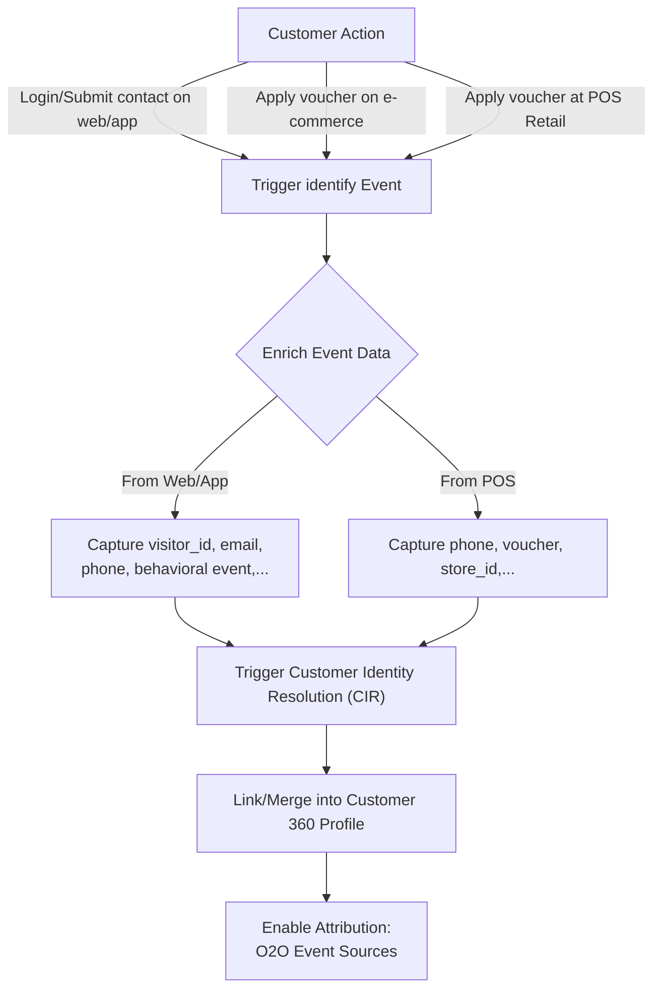
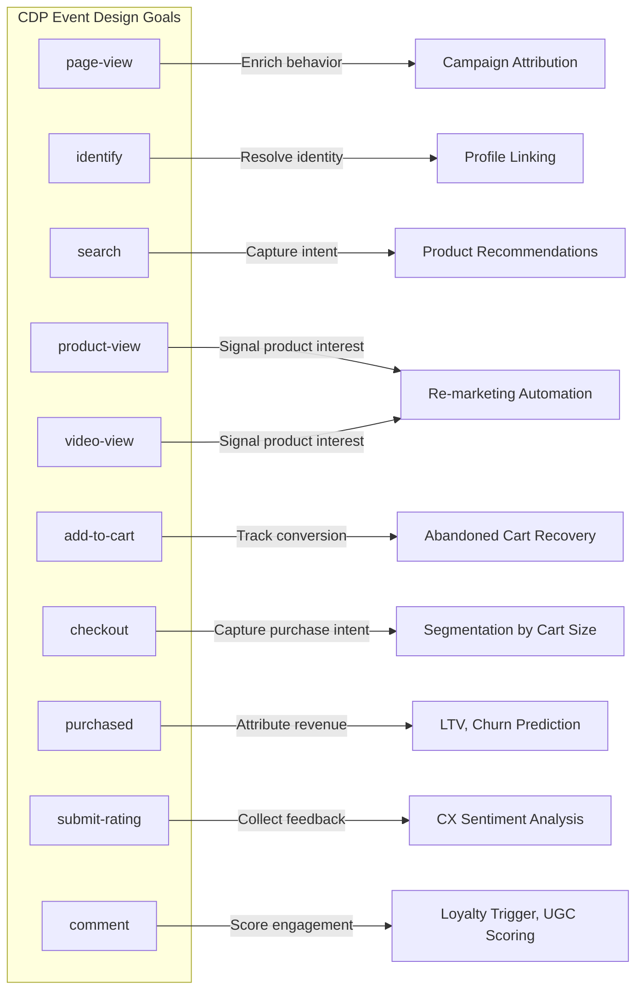

# the semantics of the **`identify`** event in your O2O CDP:

1. **Use `identify` as the metric name for the `login` event** — this means "identify" is the **semantic label** used when a customer authenticates.

2. **Also use `identify` when a customer applies a voucher code at a retail store**, if the voucher was sourced from official social media (e.g., Facebook, Zalo OA).

The **"identity moments"** is used across channels, whether they're explicit logins or campaign-driven offline activations. Here's the **updated and expanded full CDP Design Goals per Event table** based on your rules.

---

### 📊 CDP Design Goals per Event (O2O Retail) – Enhanced Version

| **Event**       | **Metric Name / Alias** | **Trigger Context**                                        | **Data Collected**                                                                 | **Identity Use**         | **CDP Use Case**                               |
| --------------- | ----------------------- | ---------------------------------------------------------- | ---------------------------------------------------------------------------------- | ------------------------ | ---------------------------------------------- |
| `page-view`     | `page_view`             | Web or app page load                                       | URL, referrer, UTM, timestamp, anonymous ID                                        | Behavior enrichment      | Funnel tracking, campaign attribution          |
| `identify`      | `identify`              | - User submits personal information to get voucher<br>- User logs in<br>- Customer applies social voucher at POS | userId, email, phone, voucher code, channel (e.g. "FB", "Zalo"), store ID          | Identity resolution      | Session stitching, social-to-store attribution |
| `search`        | `search`                | Search bar in web/app, voice search in-store kiosk         | search term, filters, location, device                                             | Intent capture           | Interest-based recommendations                 |
| `product-view`  | `product_view`          | Views product in app/web/in-store QR scan                  | product ID/SKU, price, inventory, category, store/app session                      | Product affinity signals | Personalization, bundling logic                |
| `add-to-cart`   | `add_to_cart`           | Adds product to cart (digital)                             | product ID, cart ID, quantity, price                                               | Conversion tracking      | Abandoned cart automation                      |
| `checkout`      | `checkout_start`        | Begins checkout                                            | cart contents, total price, shipping address                                       | Transaction context      | Funnel monitoring, segmentation by cart size   |
| `purchased`     | `purchase_complete`     | Completes order online or in-store (POS sync)              | order ID, total value, items, channel (online/offline), payment method, loyalty ID | Revenue attribution      | LTV calculation, churn modeling                |
| `submit-rating` | `rating_submitted`      | Rates purchased item                                       | product ID, score, review text                                                     | Feedback signal          | Product QA, sentiment analysis                 |
| `comment`       | `user_comment`          | Posts comment or UGC content online or via app             | comment text, topic, target object (product, brand), user ID                       | Engagement scoring       | UGC incentive logic, loyalty program trigger   |

---

### 🎯 Special Use of `identify`

| **Scenario**                                | **Event**  | **CDP Behavior**                                                               |
| ------------------------------------------- | ---------- | ------------------------------------------------------------------------------ |
| User logs in on app or web                  | `identify` | Merge session + assign known user ID                                           |
| User enters voucher code from social media  | `identify` | Create/merge user profile with voucher metadata, even if not logged in         |
| Voucher used at POS with phone number/email | `identify` | Sync retail event with digital identity → social campaign attribution to store |

---

### 🧠 Key Insights

* Using `identify` across **both login and social campaign activation** aligns all customer moments that matter for **profile linking**.

* You can enrich `identify` with traits like:

  ```json
    {
        "schema_version": "2025.04.28",
        "event_id": "5ed708ca-a682-4c26-969b-5c339554b5ea",
        "tenant_id": "PNJ",
        "datetime": "2025-05-06T04:00:00Z",
        "unix_timestamp": 1746529570870,
        "metric": "identify",
        "visid": "2b02723f-2dcb-440b-8498-532331d76e8e",
        "mediahost": "www.pnj.com.vn",
        "tpurl": "https://www.pnj.com.vn/",
        "profile_traits": 
        {
            "phone_number": "0903122290",
            "first_name": "Trieu",
            "last_name": "Nguyen",
            "gender": "male",
            "date_of_birth": "1986-08-16",
            "email": "trieu@example.com",
            "source_system": "ecommerce",
            "address_line1": "Phu Lam B",
            "city": "Hochiminh City",
            "ext_attributes": 
            {
                "voucher_code": "FB2025-HELLO",
                "referrer": "facebook",
                "store_id": "store_001",
                "source": "offline_redeem",
                "loyalty_level": "gold"   
            }
        }
    }
  ```

* Your attribution engine can now tell:

  > "Customer X applied FB voucher offline → matched to digital identity → completed purchase"

# CDP identify Event Semantics – Flow Diagram



# CDP Design Goals per Event (O2O Retail)

