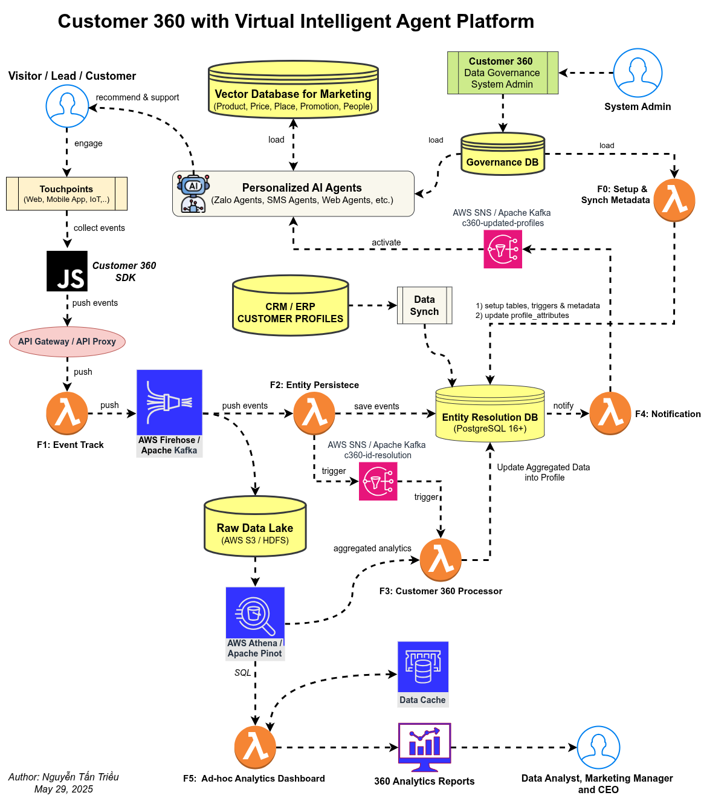

# **Customer 360 Platform \- Tasks & Test Cases**

**Epic**: Customer 360 Virtual Intelligent Agent Platform  
**Description**: Build a comprehensive Customer 360 platform with AI-powered personalized agents for marketing automation, customer engagement, and in-depth analytics.

## **1. Frontend & Customer Touchpoints**

### **TASK-001: Implement Customer Touchpoints Integration (SDKs & Event Collection)**

* **Story Points:** 10  
* **Priority:** High  
* **Components:** Web SDK (JS), Mobile App SDK (iOS/Android), IoT device connectors, API Gateway  
* **Description:** Develop and integrate client-side SDKs and connectors for various customer touchpoints (Web, Mobile App, IoT devices) to collect interaction events and push them to the central API Gateway.  

* **Acceptance Criteria:**  
    * Web SDK successfully integrates with websites and tracks predefined events (page views, clicks, form submissions, custom events).  
    * Mobile App SDK (iOS & Android) successfully integrates and tracks screen views, user actions, and custom app events.  
    * IoT device connection mechanisms are established to capture relevant events.  
    * All SDKs/connectors reliably push event data in a standardized format to the API Gateway endpoint.  
    * SDKs support offline event queuing and synchronization when connectivity is restored.  
    * Event data includes essential fields: timestamp, user\_id/device\_id, event\_type, session\_id, event\_properties.  

* **Test Cases:**  
    * **TC-001-01:** Verify web SDK captures page views, clicks, and form submissions correctly.  
    * **TC-001-02:** Test mobile app SDK tracks user interactions (e.g., button taps, screen flows) and app lifecycle events.  
    * **TC-001-03:** Validate IoT device events (e.g., sensor readings, status changes) are properly formatted and transmitted.  
    * **TC-001-04:** Confirm event data payload structure and content pushed to API Gateway are correct and complete.  
    * **TC-001-05:** Test offline event queuing (disconnect network, generate events, reconnect) and verify successful sync.  
    * **TC-001-06:** Verify SDKs handle unique user/device identification consistently.  
    * **TC-001-07:** Test custom event tracking with dynamic properties for both web and mobile SDKs.

## **2. Event Processing & Data Pipeline**

### **TASK-002: Develop F1: Event Ingestion & Initial Processing System**

* **Story Points:** 13  
* **Priority:** High  
* **Components:** API Gateway, AWS Lambda (F1), AWS Firehose/Apache Kafka (for Raw Data Lake stream)  
* **Description:** Build a serverless event ingestion and initial processing system (F1). The API Gateway receives events from touchpoints, triggering an AWS Lambda function (F1) for validation, enrichment (e.g., adding server timestamp, geo-IP), and forwarding to AWS Firehose/Apache Kafka stream destined for the Raw Data Lake.  

* **Acceptance Criteria:**  
    * API Gateway endpoint is configured to accept POST requests with event payloads from SDKs.  
    * F1 Lambda function is triggered by API Gateway events.  
    * F1 Lambda performs schema validation on incoming events; malformed events are routed to a dead-letter queue (DLQ).  
    * F1 Lambda enriches events with server-side information (e.g., ingestion timestamp).  
    * F1 Lambda successfully publishes validated and enriched events to the designated AWS Firehose/Apache Kafka stream for Raw Data Lake.  
    * System handles high throughput of events with low latency.  
* **Test Cases:**  
    * **TC-002-01:** Verify API Gateway accepts valid event payloads and rejects unauthorized requests.  
    * **TC-002-02:** Test F1 Lambda function processes events within defined SLA (e.g., \< 200ms).  
    * **TC-002-03:** Validate event schema validation rejects malformed data and routes it to DLQ.  
    * **TC-002-04:** Confirm events published to Firehose/Kafka stream contain original and enriched data.  
    * **TC-002-05:** Test error handling for F1 Lambda (e.g., downstream service unavailability).  
    * **TC-002-06:** Perform load testing on the API Gateway and F1 Lambda to ensure scalability.  
    * **TC-002-07:** Verify events in Firehose/Kafka stream are correctly formatted for Raw Data Lake consumption.

### **TASK-003: Implement F2: Entity & Event Persistence Layer**

* **Story Points:** 10  
* **Priority:** High  
* **Components:** AWS Lambda (F2), Entity Resolution DB (PostgreSQL), AWS SNS/Apache Kafka (c360-id-resolution topic)  
* **Description:** Create an entity and event persistence system (F2). This system consumes events (e.g., from a dedicated stream post-F1 or specific events from CRM sync), saves relevant event data and initial entity information into the Entity Resolution Database (PostgreSQL), and then publishes a message to the c360-id-resolution Kafka topic to trigger the F3 Customer 360 Processor. 

* **Acceptance Criteria:**  
    * F2 Lambda consumes events from its designated input source(s).  
    * F2 Lambda persists key event details and initial entity data (e.g., user identifiers, device IDs) into the Entity Resolution DB.  
    * F2 Lambda handles data deduplication at the initial persistence stage if applicable.  
    * F2 Lambda publishes a message containing relevant identifiers to the c360-id-resolution Kafka topic after successful persistence.  
    * Database transactions are managed correctly (commit/rollback).  

* **Test Cases:**  
    * **TC-003-01:** Test event persistence in PostgreSQL with proper indexing and data integrity.  
    * **TC-003-02:** Verify F2 Lambda processes messages from its input reliably.  
    * **TC-003-03:** Validate initial entity data creation in the Entity Resolution DB.  
    * **TC-003-04:** Test database transaction rollback on processing failures within F2.  
    * **TC-003-05:** Confirm messages are correctly published to the c360-id-resolution topic with necessary information for F3.  
    * **TC-003-06:** Test F2 behavior with duplicate events if it's responsible for initial deduplication.

## **3. Data Storage & Management**

### **TASK-004: Setup Raw Data Lake Infrastructure & Query Layer**

* **Story Points:** 8  
* **Priority:** Medium  
* **Components:** AWS S3/HDFS, AWS Firehose/Apache Kafka, AWS Athena/Apache Pinot  
* **Description:** Establish and configure the Raw Data Lake (AWS S3 or HDFS) for storing all raw customer interaction data. Configure the streaming ingest mechanism (Firehose/Kafka output from F1). Set up AWS Athena/Apache Pinot for querying the raw data.  

* **Acceptance Criteria:**  
    * S3 bucket/HDFS is configured with an optimal partitioning strategy (e.g., by date, event type).  
    * Data retention and lifecycle policies are implemented for the Raw Data Lake.  
    * Access controls and security configurations (encryption at rest) are in place.  
    * AWS Firehose/Kafka stream is correctly configured to deliver data to the Raw Data Lake.  
    * AWS Athena/Apache Pinot schemas are defined over the Raw Data Lake, enabling SQL-based querying.  
* **Test Cases:**  
    * **TC-004-01:** Verify data partitioning in S3/HDFS by date and event type.  
    * **TC-004-02:** Test data retention policy (e.g., data moves to Glacier or is deleted after a period).  
    * **TC-004-03:** Validate IAM roles and policies restrict unauthorized access to raw data.  
    * **TC-004-04:** Confirm data format consistency (e.g., JSON, Parquet) in the Raw Data Lake.  
    * **TC-004-05:** Test data backup and disaster recovery procedures for the Raw Data Lake.  
    * **TC-004-06:** Execute test queries using Athena/Pinot on the Raw Data Lake and verify results.  
    * **TC-004-07:** Verify Firehose/Kafka delivery to S3/HDFS is reliable and without data loss.

### **TASK-005: Build Entity Resolution Database (PostgreSQL 16+)**

* **Story Points:** 8  
* **Priority:** High  
* **Components:** PostgreSQL 16+  
* **Description:** Design, create, and configure the centralized Entity Resolution Database using PostgreSQL 16+. This database will store resolved customer identities, detailed customer profiles, aggregated metrics, and potentially event summaries.  

* **Acceptance Criteria:**  
  * Database schema is designed and implemented to support customer entities, attributes, identity graphs, event relationships, and aggregated 360 profiles.  
  * Appropriate indexing strategies are implemented for performance on key lookup and join operations.  
  * Database is optimized for read-heavy (for analytics/AI agents) and write-heavy (for F2/F3 updates) operations.  
  * Security measures (access control, encryption if needed) are applied.  
  * Stores aggregated Customer 360 profiles and attributes populated by the F3 processor.  

* **Test Cases:**  
    * **TC-005-01:** Test customer profile creation, update, and deletion operations.  
    * **TC-005-02:** Verify identity matching logic can be queried/supported by the schema (actual matching logic is in F3).  
    * **TC-005-03:** Validate profile aggregation storage calculates and stores correct metrics (populated by F3).  
    * **TC-005-04:** Test database performance with a target volume of customer records (e.g., 1M+).  
    * **TC-005-05:** Confirm data consistency during concurrent read/write operations.  
    * **TC-005-06:** Test profile merge functionality support within the schema.  
    * **TC-005-07:** Verify schema correctly stores all defined profile\_attributes.

## **4. CRM Integration & Data Synchronization**

### **TASK-006: Develop CRM/ERP Integration & Data Synchronization Module**

* **Story Points:** 10  
* **Priority:** High  
* **Components:** Data Sync Service, API Connectors (for Salesforce, HubSpot, etc.), AWS SNS/Apache Kafka (c360-id-resolution topic)  
* **Description:** Build an integration module to synchronize customer profiles and relevant data between existing CRM/ERP systems and the Customer 360 platform. This involves extracting data from CRM/ERP and pushing identifiers/updates to the c360-id-resolution Kafka topic for processing by F3.  

* **Acceptance Criteria:**  
    * Secure connection and data extraction from specified CRM/ERP systems.  
    * Ability to perform initial bulk load and ongoing incremental (delta) synchronization.  
    * Data mapping between CRM/ERP fields and Customer 360 attributes is correctly implemented.  
    * Conflict resolution strategies for data discrepancies are defined (and potentially implemented if bidirectional sync is a goal).  
    * Successfully publishes customer profile updates/identifiers to the c360-id-resolution Kafka topic.  

* **Test Cases:**  
    * **TC-006-01:** Test initial bulk sync of customer profiles from CRM to the c360-id-resolution topic.  
    * **TC-006-02:** Verify incremental updates in CRM (new customer, updated contact info) are detected and pushed to the c360-id-resolution topic.  
    * **TC-006-03:** Validate conflict resolution logic if data differs (e.g., which source wins, or flag for manual review).  
    * **TC-006-04:** Test batch synchronization processes complete successfully within expected timeframes.  
    * **TC-006-05:** Confirm API rate limiting and error handling for CRM/ERP connectors.  
    * **TC-006-06:** Test data mapping and transformation accuracy during sync.  
    * **TC-006-07:** Verify messages published to c360-id-resolution topic are correctly formatted for F3 consumption.

## **5. AI Agent Platform**

### **TASK-007: Build Personalized AI Agents Framework**

* **Story Points:** 21  
* **Priority:** High  
* **Components:** AI/ML Engine, NLP Services, Vector Database, Communication Channel Integrations (Zalo, SMS, Web Chat), AWS SNS/Apache Kafka (c360-updated-profiles topic)  
* **Description:** Develop the framework for personalized AI agents capable of engaging with customers across multiple channels (Zalo, SMS, Web). Agents will leverage customer profiles from the Customer 360 platform and marketing data from the Vector Database for personalization. 

* **Acceptance Criteria:**  
    * Core AI agent logic for intent recognition, dialogue management, and response generation is implemented.  
    * Agents can be configured with different personalities and behavioral rules.  
    * Integration with communication channels (Zalo, SMS, Web Chat APIs) is functional.  
    * Agents can access and utilize customer profile data (from Entity Resolution DB or Data Cache) for personalization.  
    * Agents can query the Vector Database for product/service recommendations and contextual information.  
    * Agents subscribe to (or are notified via F4 from) the c360-updated-profiles Kafka topic to receive real-time updates to customer data.  

* **Test Cases:**  
    * **TC-007-01:** Test AI agent responds appropriately and accurately to common customer queries and intents.  
    * **TC-007-02:** Verify agent personalization uses customer profile data (e.g., name, past interactions, preferences).  
    * **TC-007-03:** Validate agent maintains conversation context across multiple turns.  
    * **TC-007-04:** Test agent functionality on each integrated channel (Zalo, SMS, Web).  
    * **TC-007-05:** Confirm agent escalation to a human operator works correctly when defined criteria are met.  
    * **TC-007-06:** Test agent's ability to retrieve and use information from the Vector Database for recommendations.  
    * **TC-007-07:** Verify agent behavior updates based on real-time profile changes received from c360-updated-profiles topic.

### **TASK-008: Implement Vector Database for Marketing Intelligence**

* **Story Points:** 8  
* **Priority:** Medium  
* **Components:** Vector Database (e.g., Pinecone, Weaviate, or self-managed), Data Ingestion Scripts for Marketing Content  
* **Description:** Setup and populate a Vector Database to store embeddings of marketing content (Product descriptions, Prices, Place information, Promotions, People/Personas). This database will be queried by AI agents for contextual recommendations and information.  

* **Acceptance Criteria:**  
    * Vector Database is provisioned and configured.  
    * Scripts for generating embeddings from marketing content (text, images if applicable) are developed.  
    * Marketing data is loaded into the Vector Database as embeddings.  
    * Similarity search capabilities are functional and optimized for performance.  
    * AI agents can successfully query the Vector Database.  

* **Test Cases:**  
    * **TC-008-01:** Test vector embedding generation for various types of marketing content.  
    * **TC-008-02:** Verify similarity search returns relevant results for sample queries.  
    * **TC-008-03:** Validate Vector Database query performance under expected load from AI agents.  
    * **TC-008-04:** Test integration of AI agents with the Vector Database for fetching recommendations.  
    * **TC-008-05:** Confirm data consistency and accuracy of embeddings in the Vector Database.  
    * **TC-008-06:** Test updating and deleting content in the Vector Database.

## **6. Analytics & Processing**

### **TASK-009: Develop F3: Customer 360 Profile Processor & Aggregator**

* **Story Points:** 13  
* **Priority:** High  
* **Components:** AWS Lambda (F3), AWS Athena/Apache Pinot, Entity Resolution DB, Data Cache, AWS SNS/Apache Kafka (c360-id-resolution & c360-updated-profiles topics)  
* **Description:** Build the F3 Customer 360 Processor. This core component consumes messages from the c360-id-resolution topic, performs identity resolution, queries the Raw Data Lake (via Athena/Pinot) for detailed event history, aggregates data to build/update unified customer profiles in the Entity Resolution DB, updates the Data Cache, and publishes notifications to the c360-updated-profiles topic.  

* **Acceptance Criteria:**  
    * F3 Lambda is triggered by messages on the c360-id-resolution Kafka topic.  
    * Implements robust identity resolution logic (e.g., rule-based, probabilistic matching) using data from Entity Resolution DB and incoming events.  
    * Successfully queries the Raw Data Lake using Athena/Pinot for customer event history.  
    * Aggregates raw event data and CRM data into meaningful customer attributes and metrics.  
    * Creates new or updates existing unified customer profiles in the Entity Resolution DB.  
    * Populates/updates the Data Cache with the latest aggregated profile information.  
    * Publishes a message to the c360-updated-profiles Kafka topic upon successful profile update.  

* **Test Cases:**  
    * **TC-009-01:** Test F3 correctly consumes messages from c360-id-resolution topic.  
    * **TC-009-02:** Verify identity resolution correctly merges records for the same customer from different sources/identifiers.  
    * **TC-009-03:** Validate F3 accurately queries and utilizes data from the Raw Data Lake via Athena/Pinot.  
    * **TC-009-04:** Confirm calculated/aggregated attributes in the unified profile are correct.  
    * **TC-009-05:** Test profile creation for new customers and updates for existing customers in Entity Resolution DB.  
    * **TC-009-06:** Verify Data Cache is updated accurately and promptly by F3.  
    * **TC-009-07:** Confirm F3 publishes correctly formatted messages to c360-updated-profiles topic.  
    * **TC-009-08:** Test F3 processor handles high-volume data streams and concurrent updates.

### **TASK-010: Setup F5: Ad-hoc Analytics Dashboard Backend & Querying**

* **Story Points:** 8  
* **Priority:** Medium  
* **Components:** AWS Lambda (F5 backend) / API Service, AWS Athena/Apache Pinot, Data Cache, SQL Interface  
* **Description:** Develop the backend service (F5) for the Ad-hoc Analytics Dashboard. This service will provide an API for the frontend to query customer data, primarily from the Data Cache for speed, and from the Raw Data Lake (via Athena/Pinot) or Entity Resolution DB for more complex or historical queries.  

* **Acceptance Criteria:**  
    * F5 service exposes secure API endpoints for ad-hoc queries.  
    * Service can query Data Cache for fast retrieval of aggregated profiles.  
    * Service can execute queries against Raw Data Lake (via Athena/Pinot) and Entity Resolution DB.  
    * Query results are returned in a format suitable for frontend visualization.  
    * User authentication and authorization for data access are implemented.  

* **Test Cases:**  
    * **TC-010-01:** Test API endpoints for various query types (e.g., segmentation, trend analysis).  
    * **TC-010-02:** Verify queries to Data Cache are significantly faster than direct DB/Datalake queries for common use cases.  
    * **TC-010-03:** Validate SQL queries executed via Athena/Pinot on the Raw Data Lake return correct results.  
    * **TC-010-04:** Test data aggregation and transformation logic within the F5 service if any.  
    * **TC-010-05:** Confirm user access controls prevent unauthorized data access through F5 APIs.  
    * **TC-010-06:** Test dashboard query performance with large datasets and concurrent users.

## **7. Governance & Administration**

### **TASK-011: Implement Customer 360 Data Governance System & Admin Interface**

* **Story Points:** 10  
* **Priority:** High  
* **Components:** Governance Database, Admin Web Interface, F0 Lambda integration  
* **Description:** Build a data governance system including a Governance Database to store metadata, rules, and configurations, and an Admin Interface for system administrators to manage these aspects, including triggering F0 for metadata synchronization.  

* **Acceptance Criteria:**  
    * Governance Database schema is defined and implemented to store metadata, data quality rules, access policies, and profile\_attributes definitions.  
    * Secure web-based Admin Interface for managing governance settings.  
    * Admins can view and manage data lineage information (if captured).  
    * Admins can define and manage access control policies for data access.  
    * Audit logging for administrative actions and critical data access is implemented.  
    * Admin interface allows management of profile\_attributes definitions, which F0 can then sync to Entity Resolution DB.  

* **Test Cases:**  
    * **TC-011-01:** Test admin login and role-based access to the Admin Interface.  
    * **TC-011-02:** Verify admin can create, update, and delete metadata definitions (e.g., new profile\_attributes).  
    * **TC-011-03:** Validate audit logs capture all administrative changes and sensitive data access attempts.  
    * **TC-011-04:** Test data lineage visualization or reporting if implemented.  
    * **TC-011-05:** Confirm compliance reporting functionality based on governance rules.  
    * **TC-011-06:** Test triggering of F0 metadata sync from the admin interface.

### **TASK-012: Implement F0: Metadata Management & Synchronization System**

* **Story Points:** 8  
* **Priority:** Medium  
* **Components:** AWS Lambda (F0), Governance Database, Entity Resolution DB  
* **Description:** Implement the F0 Lambda function responsible for system setup and synchronization of metadata. This includes initializing/updating schemas in the Entity Resolution DB, managing profile\_attributes definitions, and ensuring consistency between the Governance DB and operational systems.  

* **Acceptance Criteria:**  
    * F0 Lambda can be triggered (e.g., by Admin Interface, scheduled, or manually).  
    * F0 can read configurations and metadata definitions from the Governance Database.  
    * F0 can set up or update table structures, indexes, and triggers in the Entity Resolution Database.  
    * F0 can manage the list of active profile\_attributes used by F3 (e.g., by updating a reference table in Entity Resolution DB or ensuring F3 reads from Governance DB).  
    * Supports schema evolution for key databases with minimal disruption.  

* **Test Cases:**  
    * **TC-012-01:** Test F0 successfully initializes the schema in a new Entity Resolution DB.  
    * **TC-012-02:** Verify F0 can apply updates to the Entity Resolution DB schema (e.g., add a new column).  
    * **TC-012-03:** Test F0 correctly updates the profile\_attributes list available to the F3 processor based on Governance DB.  
    * **TC-012-04:** Validate F0's error handling and rollback capabilities during failed synchronization.  
    * **TC-012-05:** Test impact of schema evolution managed by F0 on existing data and processes.

## **8. Notifications & Reporting**

### **TASK-013: Build F4: Intelligent Notification System**

* **Story Points:** 8  
* **Priority:** High  
* **Components:** AWS Lambda (F4), Notification Services (e.g., AWS SNS, SendGrid, Twilio), AWS SNS/Apache Kafka (c360-updated-profiles topic)  
* **Description:** Create an intelligent notification system (F4) triggered by messages on the c360-updated-profiles topic. F4 will send personalized notifications to customers or internal alerts based on profile updates and predefined rules. 

* **Acceptance Criteria:**  
    * F4 Lambda is triggered by messages on the c360-updated-profiles Kafka topic.  
    * Supports multiple notification channels (e.g., email, SMS, push notifications, webhook to AI Agents).  
    * Notification content can be personalized using customer profile data.  
    * Delivery status tracking and basic analytics (sends, opens if possible) are implemented.  
    * Respects customer communication preferences and DND settings.  

* **Test Cases:**  
    * **TC-013-01:** Test F4 is triggered by c360-updated-profiles messages and sends notifications via configured channels (email, SMS).  
    * **TC-013-02:** Verify personalized content in notifications using dynamic data from the profile update event.  
    * **TC-013-03:** Validate delivery tracking and status updates are recorded.  
    * **TC-013-04:** Test customer preference management (e.g., unsubscribing from a notification type).  
    * **TC-013-05:** Confirm notification scheduling, throttling, and retry mechanisms work as expected.  
    * **TC-013-06:** Test integration with AI agents if F4 is used to push updates to them.

### **TASK-014: Develop 360 Analytics Reports & Frontend Dashboard**

* **Story Points:** 10  
* **Priority:** Medium  
* **Components:** Reporting Engine/Frontend Framework, Data Cache, F5 Service API  
* **Description:** Build a comprehensive analytics reporting system and an interactive frontend dashboard for business users (Data Analysts, Marketing Managers, CEO) to view Customer 360 insights, leveraging data provided by the F5 backend service.  

* **Acceptance Criteria:**  
    * Web-based dashboard providing visualizations of key Customer 360 metrics.  
    * Pre-built report templates for common analyses (e.g., customer segmentation, LTV, churn prediction).  
    * Interactive features like filtering, drill-down, and date range selection.  
    * Ability to export reports and visualizations (e.g., PDF, CSV).  
    * Role-based access control to reports and dashboards. 

* **Test Cases:**  
    * **TC-014-01:** Test accuracy of data displayed in pre-built reports against source data (via F5).  
    * **TC-014-02:** Verify scheduled report generation and delivery (if applicable).  
    * **TC-014-03:** Validate interactive filtering and drill-down functionalities update visualizations correctly.  
    * **TC-014-04:** Test export functionality for various formats and ensure data integrity.  
    * **TC-014-05:** Confirm dashboard performance and responsiveness with typical data volumes.  
    * **TC-014-06:** Test report sharing and permission controls.

## **9. Performance & Scalability**

### **TASK-015: Implement Data Caching Strategy**

* **Story Points:** 5  
* **Priority:** Medium  
* **Components:** Redis/ElastiCache (or other caching solution), F3 Processor, F5 Service, AI Agents  
* **Description:** Design and implement a data caching layer (e.g., using Redis/ElastiCache) to store frequently accessed aggregated customer profiles and other data to improve system performance and reduce load on primary databases.  

* **Acceptance Criteria:**  
    * Cache stores frequently accessed customer profile segments and aggregated data.  
    * F3 processor correctly populates and invalidates/updates the cache upon profile changes.  
    * F5 Ad-hoc Analytics service and AI Agents can efficiently read data from the cache.  
    * Cache hit/miss ratios are monitored.  
    * Cache clustering and eviction policies are configured for high availability and optimal performance.  

* **Test Cases:**  
    * **TC-015-01:** Measure and verify response time improvement for queries hitting the cache vs. direct DB access.  
    * **TC-015-02:** Test cache invalidation logic: ensure cache is updated/invalidated promptly when underlying data changes via F3.  
    * **TC-015-03:** Validate cache clustering and failover mechanisms if applicable.  
    * **TC-015-04:** Test cache performance under high read load from F5 and AI Agents.  
    * **TC-015-05:** Monitor and confirm cache hit ratio meets target (e.g., \>80% for designated queries).

## **10. System-Wide Concerns**

### **TASK-016: Implement Platform-Wide Logging, Monitoring, and Alerting**

* **Story Points:** 8  
* **Priority:** High  
* **Components:** AWS CloudWatch, ELK Stack (or similar), Prometheus, Grafana  
* **Description:** Establish a comprehensive logging, monitoring, and alerting strategy across all components of the Customer 360 platform to ensure operational visibility, quick issue detection, and proactive maintenance.  

* **Acceptance Criteria:**  
    * Centralized logging solution collects logs from all services (Lambdas, applications, databases).  
    * Key performance indicators (KPIs) for each component are defined and monitored (e.g., Lambda invocation/error rates, API latency, queue lengths, DB CPU/memory).  
    * Dashboards are created for visualizing system health and KPIs.  
    * Alerts are configured for critical errors, performance degradation, and resource exhaustion.  
    * Distributed tracing is implemented for key workflows.  

* **Test Cases:**  
    * **TC-016-01:** Verify logs from all major components are successfully ingested into the centralized logging system.  
    * **TC-016-02:** Test generation of alerts when predefined error or performance thresholds are breached.  
    * **TC-016-03:** Validate monitoring dashboards display accurate real-time metrics.  
    * **TC-016-04:** Simulate a component failure and verify that appropriate alerts are triggered and relevant logs are available for diagnosis.  
    * **TC-016-05:** Test distributed tracing by following a single request through multiple services.

### **TASK-017: Implement Security Best Practices and Hardening**

* **Story Points:** 10  
* **Priority:** High  
* **Components:** All platform components, IAM, VPC, Security Groups, Encryption mechanisms  
* **Description:** Implement and enforce security best practices across the entire platform, including network security, access control, data encryption, and regular security audits.  

* **Acceptance Criteria:**  
    * Principle of Least Privilege is applied to all IAM roles and policies.  
    * Network security is configured (VPCs, subnets, security groups, NACLs) to restrict access.  
    * Data is encrypted at rest (S3, DBs, Kafka topics) and in transit (HTTPS, SSL/TLS).  
    * Input validation and output encoding are implemented to prevent common web vulnerabilities (XSS, SQLi).  
    * The Secret management solution is used for API keys, database credentials, etc.  
    * Regular security vulnerability scans are planned and executed.  

* **Test Cases:**  
    * **TC-017-01:** Review IAM roles for overly permissive policies.  
    * **TC-017-02:** Verify encryption at rest and in transit for all sensitive data stores and communication channels.  
    * **TC-017-03:** Perform penetration testing (or basic vulnerability scanning) on exposed API endpoints.  
    * **TC-017-04:** Test input validation mechanisms by attempting to inject malicious data.  
    * **TC-017-05:** Verify access controls prevent unauthorized users/services from accessing restricted resources or functionalities.  
    * **TC-017-06:** Audit secrets management practices.

### **TASK-018: End-to-End Customer Journey & System Integration Testing**

* **Story Points:** 13  
* **Priority:** High  
* **Components:** All Platform Components  
* **Description:** Conduct comprehensive end-to-end testing of complete customer journeys and critical system workflows. This includes testing data flow, integration points, overall system performance, and resilience.  

* **Acceptance Criteria:**  
    * Key customer journeys (e.g., web visit \-\> event capture \-\> profile update \-\> personalized AI interaction) are validated from start to finish.  
    * Data consistency is maintained across all integrated systems and databases throughout the workflows.  
    * System performs within defined SLAs under expected and peak load conditions.  
    * Error handling and recovery mechanisms function correctly across component boundaries.  
    * All critical integration points between services are tested and verified.  

* **Test Cases:**  
    * **TC-018-01:** Test a complete customer journey: new web visitor \-\> event captured by SDK \-\> F1 processing \-\> data in Raw Data Lake \-\> F2 persistence \-\> F3 profile creation \-\> profile in Entity Resolution DB & Cache \-\> F4 notification \-\> AI Agent uses new profile for personalization.  
    * **TC-018-02:** Verify data consistency for a single customer across Raw Data Lake, Entity Resolution DB, Data Cache, and CRM (if synced).  
    * **TC-018-03:** Simulate peak load conditions (e.g., 1000 events/sec) and measure system response times and stability.  
    * **TC-018-04:** Test system behavior during failure of a single component (e.g., F3 processor down) and verify recovery process.  
    * **TC-018-05:** Confirm compliance with data processing SLAs for critical paths (e.g., time from event to profile update).  
    * **TC-018-06:** Test CRM data synchronization end-to-end, including conflict resolution.

## **Summary**

* **Total Tasks:** 18  
* **Total Story Points (Estimated):** 185  
* **High Priority Tasks:** 12  
* **Medium Priority Tasks:** 6

## **Dependencies :**

* Core infrastructure (VPC, IAM basics, Kafka cluster if self-managed) must be set up before application component development.  
* Raw Data Lake (TASK-004) and Entity Resolution DB (TASK-005) setup are prerequisites for F1, F2, F3 development.  
* The F3 Processor (TASK-009) is a central piece; many downstream components depend on its output.  
* Vector Database (TASK-008) needed before full AI agent personalization (TASK-007).  
* Governance System (TASK-011, TASK-012) should be implemented early to guide data handling and schema.

